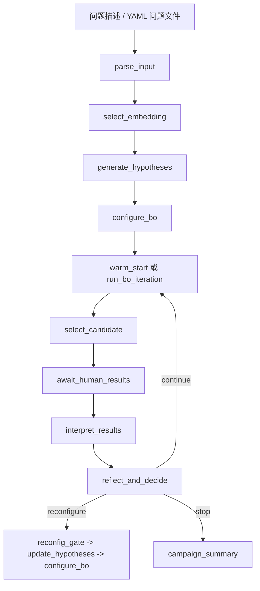

# ChemBO Agent 代码导读

这份文档按“先建立全局把握，再能亲手跑起来，最后进入源码细节”的顺序，重新介绍当前仓库中的 ChemBO Agent。

如果你只想先抓主线，可以先读：

1. `项目是什么`
2. `怎么跑实验`
3. `一次完整迭代是怎么流动的`

---

## 1. 项目是什么

### 1.1 一句话版本

ChemBO Agent 是一个把 **LLM 推理**、**贝叶斯优化（BO）**、**化学先验知识**、**记忆系统** 和 **人类实验反馈** 组织成状态机工作流的原型系统。

它的目标不是直接“算出最优反应条件”，而是模拟一个真实的优化 campaign：

- 先理解问题
- 选择合适的表示方式和 BO 组件
- 提出下一轮实验条件
- 等待实验结果
- 根据结果更新认知
- 决定继续、重配 BO、还是停止

### 1.2 当前仓库更准确的定位

这个仓库现在更像一个 **Phase 1 可运行研究原型**，而不是一个完整生产系统。它有三个很明确的特点：

- 它真的能跑 end-to-end
- 它支持两种实验反馈模式：真人输入、或数据集自动充当“实验 oracle”
- 它保留了很多“未来更强实现”的接口，但当前默认围绕可落地的 BoTorch 单目标 BO 栈运行

也就是说，很多高级算法名词在代码里仍然带有“可选/可降级”的设计：

- `llm_embedding` 会回退到 `one_hot`
- `qlog_ei` 在 Phase 1 仍是基于候选池逐点评分的 batch 近似

这不是 bug，而是这个仓库刻意采用的设计：先把工作流跑通，再逐步增强算法栈。

### 1.3 你应该怎样理解这个系统

最好的理解方式不是“它有哪些文件”，而是“它如何完成一次实验迭代”：



这里最核心的不是单个算法，而是这条闭环：

**问题定义 -> 建模配置 -> 实验提议 -> 结果反馈 -> 认知更新 -> 再决策**

---

## 2. 整体架构

### 2.1 代码分层

当前仓库可以分成六层：

1. 入口与配置
   - `main.py`
   - `test_interactive.py`
   - `config/settings.py`

2. 问题定义与运行驱动
   - `core/problem_loader.py`
   - `core/campaign_runner.py`
   - `core/dataset_oracle.py`

3. 状态与工作流图
   - `core/state.py`
   - `core/graph.py`
   - `core/context_builder.py`

4. 决策能力底座
   - `knowledge/reaction_kb.py`
   - `memory/memory_manager.py`

5. BO 组件与工具
   - `pools/component_pools.py`
   - `tools/chembo_tools.py`

6. 测试与回归
   - `test_mock.py`
   - `test_dataset_dar.py`
   - `test_dar_smiles_chain.py`
   - `test_graph_review_regressions.py`

### 2.2 每层各自负责什么

- `problem_loader` 负责把自然语言或 YAML/JSON 问题规范化成统一 `problem_spec`
- `state.py` 定义 LangGraph 中所有节点共享的全局状态
- `graph.py` 负责真正的“智能体脑图”，定义节点、路由和终止条件
- `component_pools.py` 提供 encoder、surrogate、kernel、acquisition 的注册表和轻量实现
- `chembo_tools.py` 负责把这些能力包装成 LLM 可调用工具，并实现 BO shortlist 生成
- `campaign_runner.py` 负责把图跑起来，并在 `interrupt()` 处接回真人输入或数据集结果

### 2.3 当前最重要的设计判断

这个项目最重要的设计不是“用没用 LangGraph”，而是下面这几个选择：

- 用一个共享状态 `ChemBOState` 作为全局事实来源
- 把 BO 的关键决策拆成多个节点，而不是一个大 prompt
- 把“实验反馈”做成中断点 `interrupt()`，使流程天然支持 HITL
- 把当前不可用或不稳定的高级组件统一做成可解释的 fallback
- 用 dataset-backed oracle 做 benchmark，从而在没有真实实验室的情况下测试闭环

---

## 3. 怎么跑代码和实验

这一节按“最常用”到“更灵活”的顺序来。

### 3.1 安装依赖

建议先创建虚拟环境，再安装：

```bash
python -m venv .venv
source .venv/bin/activate
pip install -r requirements.txt
```

几个现实注意点：

- `torch/gpytorch/botorch`、`numpy`、`pyyaml`、`langgraph` 是核心依赖
- `rdkit-pypi` 决定 chemistry-aware encoder 能否真正工作
- 当前默认依赖已把 `numpy` 限制在 `<2`，这是为了避免常见 RDKit wheel 与 NumPy 2 的 ABI 冲突
- 如果本机缺少 `torch/gpytorch/botorch`，BO 会退回 exploration shortlist，而不会走模型驱动评分

### 3.2 配置 LLM

当前 `config/settings.py` 支持两类 LLM 接入：

- Anthropic：`llm_model` 以 `claude` 开头时，读取 `ANTHROPIC_API_KEY`
- OpenAI 兼容端点：设置 `llm_base_url`，默认读取 `OPENAI_API_KEY`
- DashScope Kimi：当 `llm_base_url` 指向阿里云 DashScope 且 `llm_model: "kimi-k2.5"` 时，会自动读取 `DASHSCOPE_API_KEY`，并默认开启 thinking 模式

仓库默认会优先读根目录下的 `lightning.yaml`，它当前配置的是 Lightning 的 OpenAI-compatible endpoint：

```yaml
llm_model: "lightning-ai/gpt-oss-120b"
llm_base_url: "https://lightning.ai/api/v1/"
```

所以如果你直接运行默认配置，实际需要的是：

```bash
export OPENAI_API_KEY=...
```

如果你不用这个配置文件，可以传自己的 `--config`。

如果你想直接走阿里云上的 Kimi 2.5 thinking，可以用仓库里新增的配置：

```yaml
llm_model: "kimi-k2.5"
llm_base_url: "https://dashscope.aliyuncs.com/compatible-mode/v1"
llm_api_key_env: "DASHSCOPE_API_KEY"
llm_enable_thinking: true
```

运行方式例如：

```bash
python main.py --problem-file examples/dar_problem.yaml --config dashscope_kimi.yaml
```

### 3.3 最推荐的第一种跑法：数据集自动实验

这是最容易跑通、也最接近 benchmark 的方式。

命令：

```bash
python main.py --problem-file examples/dar_problem.yaml --config lightning.yaml
```

这条命令会做几件事：

- 从 `examples/dar_problem.yaml` 读取结构化问题
- 自动把 `../data/DAR.csv` 解析成数据集 oracle
- 因为 `human_input_mode: dataset_auto`，所以每次提议 candidate 后不会等你手动输入
- 系统会自动去 CSV 里查出该条件对应的 `yield`

这相当于“用离线数据集模拟真实实验回传”。

### 3.4 第二种跑法：真人交互实验

如果你想模拟真实人机协作，让程序在每轮实验后停下来等你输入结果：

1. 准备一个配置文件，把 `human_input_mode` 改成 `terminal`
2. 运行：

```bash
python test_interactive.py --problem-file examples/dar_problem.yaml --config your_config.yaml
```

运行后，在每轮候选条件提出后，终端会提示：

- 输入测得结果 `result`
- 输入备注 `notes`

`campaign_runner.py` 会把这些输入封装成 `Command(resume=...)` 恢复 LangGraph 执行。

### 3.5 第三种跑法：直接传自然语言问题

如果你不想写 YAML，也可以直接从自然语言描述启动：

```bash
python main.py --problem "Optimize the yield of a Direct Arylation Reaction ..."
```

此时 `core/graph.py` 中的 `parse_input` 节点会先让 LLM 把文本解析成结构化 `problem_spec`。

### 3.6 跑测试

如果你想确认仓库当前关键路径没有坏，最值得先跑的是：

```bash
pytest -q test_dataset_dar.py test_dar_smiles_chain.py test_graph_review_regressions.py
```

如果你想连 mock 端到端也一起跑：

```bash
pytest -q test_mock.py test_dataset_dar.py test_dar_smiles_chain.py test_graph_review_regressions.py
```

---

## 4. 先抓主线：一次完整实验是怎么跑的

这一节是整份文档最重要的部分。

### 4.1 入口：`main.py`

`main.py` 做的事情其实很少：

1. 读取 problem
2. 读取 settings
3. `build_chembo_graph(settings)`
4. `create_initial_state(problem, settings)`
5. `run_campaign(graph, initial_state, settings)`

也就是说，真正的复杂度不在入口，而在：

- 图是怎么构建的
- 状态里存了什么
- 每轮实验如何中断与恢复

### 4.2 运行循环：`core/campaign_runner.py`

`run_campaign()` 是外层驱动器：

1. 用 `graph.invoke(initial_state)` 启动图
2. 读取当前状态 `graph.get_state(config).values`
3. 只要 `state["phase"] != "completed"`，就继续循环
4. 从 `current_proposal["candidates"][0]` 取出要执行的实验
5. 根据模式决定结果来源：
   - `dataset_auto`：去 `DatasetOracle` 查 CSV
   - `terminal`：从终端读用户输入
6. 用 `Command(resume=response)` 恢复图执行

这里你可以把 LangGraph 想成“负责脑内推理”，而 `run_campaign()` 负责“把脑和外部世界接上”。

### 4.3 数据集实验模式：`core/dataset_oracle.py`

`DatasetOracle` 的作用非常直接：

- 读 CSV
- 检查候选点是否存在于数据集
- 把 candidate 精确映射到某一行
- 返回真实结果值和行元数据

在 `examples/dar_problem.yaml` 中，所有变量都被离散化成了数据集真实出现过的水平，所以这其实是一个严格的表格搜索 benchmark。

### 4.4 状态机主循环：`core/graph.py`

LangGraph 中的主链路是：

1. `parse_input`
2. `select_embedding`
3. `generate_hypotheses`
4. `configure_bo`
5. `warm_start` 或 `run_bo_iteration`
6. `select_candidate`
7. `await_human_results`
8. `interpret_results`
9. `reflect_and_decide`
10. 返回 BO，或进入重配，或结束总结

这个设计很像一个“会思考的 BO scientist assistant”，而不是单纯 optimizer。

---

## 5. 源码 Walkthrough

下面开始按模块展开。

### 5.1 配置层：`config/settings.py`

`Settings` 是全局运行参数中心，最重要的字段有：

- LLM 相关：`llm_model`、`llm_base_url`、`llm_temperature`
- BO 相关：`batch_size`、`initial_doe_size`、`shortlist_top_k`
- 记忆相关：`episodic_memory_capacity`
- 实验交互相关：`human_input_mode`

当前默认值有两个很关键：

- `human_input_mode = "dataset_auto"`
- `llm_model = "claude-sonnet-4-20250514"`，但根目录 `lightning.yaml` 会覆盖它

所以你平时真正运行时，更应该看传入的 config，而不是只看 dataclass 默认值。

### 5.2 问题加载层：`core/problem_loader.py`

这个文件的任务是把输入统一成结构化 `problem_spec`。

核心函数：

- `load_problem_file(path)`
- `normalize_problem_spec(problem_input, source_path=None)`
- `has_structured_problem_spec(problem_spec)`
- `problem_preview(problem_input)`

这里最值得注意的不是 YAML 解析，而是两个“对后面很重要”的预处理：

1. 自动解析并补齐 `smiles_map`
   - 如果变量名里含 `smiles`
   - 或 `domain` 项里本身带 `smiles`
   - 就会整理成统一映射

2. 自动解析 dataset 相对路径
   - `examples/dar_problem.yaml` 里的 `../data/DAR.csv`
   - 会在加载时解析成绝对路径

这就是为什么后面的 encoder 和 dataset oracle 能无缝接起来。

### 5.3 全局状态：`core/state.py`

`ChemBOState` 是整个系统的脊柱。

你可以把它分成几组：

- 控制流字段
  - `phase`
  - `iteration`
  - `next_action`

- 问题与知识
  - `problem_spec`
  - `knowledge_cards`
  - `retrieval_artifacts`

- BO 配置
  - `embedding_config`
  - `bo_config`
  - `effective_config`

- 决策中间产物
  - `proposal_shortlist`
  - `proposal_selected`
  - `current_proposal`

- 实验历史
  - `observations`
  - `best_result`
  - `best_candidate`
  - `performance_log`

- 认知历史
  - `hypotheses`
  - `memory`
  - `reconfig_history`
  - `config_history`

`create_initial_state()` 做了三件关键事：

- 规范化输入问题
- 设置系统提示词 `SystemMessage`
- 根据 `maximize/minimize` 初始化 `best_result`

其中系统提示词已经把工作流顺序、工具协议和输出纪律写死了，所以后续节点其实都是在这个总协议上继续加局部 prompt。

### 5.4 化学知识库：`knowledge/reaction_kb.py`

当前知识库是一个内置的轻量 KB，不是外部数据库。

内容主要分三类：

- 反应类型知识：DAR、BH、SUZUKI
- literature priors：优选 ligand/base/solvent/温度区间
- hard constraints：例如 DAR 里 DMAc 高温分解风险

最重要的接口：

- `format_knowledge_for_llm(reaction_type)`
- `get_structured_priors(reaction_type, problem_spec)`
- `get_hard_constraints(reaction_type)`

这些知识在系统里有三种用途：

1. 给 LLM 读的自然语言上下文
2. 给 warm start 用的先验偏置
3. 给候选筛选用的硬约束检查器

### 5.5 记忆系统：`memory/memory_manager.py`

这是一个三层记忆：

- Working memory
  - 当前 focus、待决策事项

- Episodic memory
  - 每轮实验发生了什么
  - 用了什么配置
  - 得到了什么结果
  - 反思与 lesson learned 是什么

- Semantic memory
  - 从多次 episode 中沉淀出的规则
  - 例如某个变量值长期表现正向/负向效应

`MemoryManager.consolidate()` 是这里最值得注意的逻辑：

- 当 observations 足够多时，会做统计汇总
- 如果某个变量取值相对全局均值偏高/偏低足够明显，就会生成 semantic rule
- 在 deep/full review 模式下，还会把重复出现的经验总结提升成规则

所以 memory 不只是“存历史”，而是在做“从历史中抽象规律”。

### 5.6 上下文构建器：`core/context_builder.py`

这个文件是整个 prompt 工程里很关键但容易被忽略的一层。

它不直接调用 LLM，而是给不同节点组装不同视角的上下文：

- `for_select_embedding`
- `for_generate_hypotheses`
- `for_configure_bo`
- `for_select_candidate`
- `for_interpret_results`
- `for_reflect_and_decide`

它的价值在于把“大而全状态”裁剪成“节点真正需要的小上下文”，避免每个节点都硬吃整个状态。

### 5.7 组件池：`pools/component_pools.py`

这是算法组件注册中心，也是当前 Phase 1 BO 实现的核心。

可以按四类看：

1. Encoder pool
   - `one_hot`
   - `fingerprint_concat`
   - `physicochemical_descriptors`
   - `hybrid_descriptor`
   - `llm_embedding`（当前会 guarded fallback）

2. Surrogate pool
   - `gp`

3. Kernel pool
   - `matern52`
   - `matern32`
   - `rbf`
   - `sum_kernel`
   - `product_kernel`
   - `mixed_sum_product`

4. Acquisition pool
   - `log_ei`
   - `ucb`
   - `ts`
   - `qlog_ei`

#### 这里有三个必须知道的现实细节

第一，`detect_runtime_capabilities()` 会显式告诉你当前能不能走 BoTorch：

- 没有 RDKit 就不能真正做分子指纹
- 没有 torch/botorch/gpytorch，就不会进入 `botorch` 运行模式

第二，很多组件是“有标签、有解释、有回退”的。

这意味着系统能让 LLM 在推理层面知道有这些算法，但执行层会选择当前环境真正可行的版本。

第三，这个文件不只是注册表，还真的实现了：

- One-hot / fingerprint / descriptor encoder
- BoTorch SingleTaskGP surrogate
- GPyTorch kernel 组合
- acquisition scoring
- mixed/discrete candidate enumeration 与采样

### 5.8 工具层：`tools/chembo_tools.py`

这个文件里有六个工具，其中最重要的是前四个：

1. `embedding_method_advisor`
2. `surrogate_model_selector`
3. `af_selector`
4. `bo_runner`
5. `hypothesis_generator`
6. `result_interpreter`

前 1 到 3 个更像“结构化建议器”：

- 它们不会直接替 LLM 做最终决策
- 而是把组件池选项、适用场景、可用性、fallback 信息整理成 JSON
- 再由 LLM 在节点 prompt 里做最后选择

`bo_runner` 才是执行型工具。

#### `bo_runner` 的真实工作

它会按下面顺序执行：

1. 解析搜索空间、观测值、配置参数
2. 创建 encoder
3. 对重复 observation 做聚合
4. 构造候选池
   - 小离散空间就枚举
   - 否则 hybrid sampling
5. 如果数据太少，直接走 warm-start fallback shortlist
6. 否则编码训练数据并拟合 surrogate
7. 计算预测均值、方差、acquisition score
8. 取 top-k 形成 shortlist

它输出的不是单个 candidate，而是一个完整 payload：

- `shortlist`
- `predictions`
- `uncertainties`
- `acquisition_values`
- `resolved_components`
- `metadata`

所以后续节点拥有的不只是“下一个点”，而是一组可供 reasoning 的候选解释空间。

#### `build_diverse_fallback_candidates()`

这个函数现在只负责“无知识假设下的通用兜底”：

- 做覆盖式/多样化候选生成
- 过滤 hard constraints 和已观测点
- 给 warm start repair、pure reasoning fallback、BO 低数据 fallback 共用

也就是说，它不再承载“knowledge-driven warm start”的职责。

### 5.9 工作流图：`core/graph.py`

这是整个仓库最核心的文件。

#### 5.9.1 LLM 构造

`_create_llm(settings)` 根据配置决定用：

- `ChatAnthropic`
- `ChatOpenAI`
- OpenAI-compatible endpoint

所以模型 provider 的切换完全由 settings 控制。

#### 5.9.2 节点设计

每个节点都遵循同一个模式：

1. 从 state 取当前上下文
2. 用 `ContextBuilder` 生成局部上下文
3. 构造严格 prompt
4. 必要时让 LLM 先调用工具
5. 解析 JSON 或工具 payload
6. 返回状态更新 dict

其中比较关键的节点如下。

##### `parse_input`

- 如果问题本来就是结构化 spec，就跳过 LLM 解析
- 否则把自然语言转成统一 schema
- 然后接上 KB context 和 structured priors

##### `select_embedding`

- 只允许做一次
- 一旦 `embedding_locked=True`，后面重配也不会改 embedding

这是一个重要设计：避免 campaign 中途表示空间变化导致前后 observation 语义不一致。

##### `generate_hypotheses` / `update_hypotheses`

- 前者用于 campaign 初始假设生成
- 后者用于 reconfiguration 前保留旧假设并增量更新

这部分把“化学直觉”显式化了，不只是让 LLM 暗中想一想。

##### `configure_bo`

这是 BO 配置决策中心：

- 让 LLM 调 `surrogate_model_selector`
- 再调 `af_selector`
- 组合成 `bo_config`

更重要的是，这里还实现了 **重配回测保护**：

- 若已有旧配置，会对新旧配置做 observation 上的 in-sample RMSE 比较
- 如果新配置恶化太多，会拒绝重配并回退旧配置

这使得“让 LLM 随意改 BO 栈”的风险被压低了很多。

##### `warm_start`

- 直接把 `knowledge_cards` 压缩成 `knowledge_guidance`
- LLM 先做初始化策略判断，再自己 propose 初始实验
- dataset-backed 问题下，LLM 会先调用 `warm_start_candidate_search` 做可行空间 grounding
- 提案结果会经过结构化验证、repair、以及 deterministic fallback 补齐
- 最终写入 `proposal_shortlist`

##### `run_bo_iteration`

这个节点没有走完整 tool loop，而是直接调用 `bo_runner.invoke(...)`。

好处是：

- 参数明确
- 输出稳定
- 不需要 LLM 再决定是否调用

##### `select_candidate`

这一步不是机械地拿 shortlist 第一个，而是让 LLM 在 shortlist 上做一次选择。

它还允许 override，但如果是 dataset-backed 问题且 override 的点不在数据集里，就会被拒绝并回到 shortlist。

##### `await_human_results`

这是系统和现实世界的连接点。

它会调用 `interrupt(...)` 暂停图执行，并在恢复时：

- 记录最新 observation
- 更新 `best_result`
- 更新 `performance_log`
- 迭代数加一

##### `interpret_results`

这一步负责把单次实验变成长期知识：

- 调 `result_interpreter`
- 更新 episode
- 更新 semantic rule
- 更新 working memory
- 根据结果修改 hypothesis status

##### `reflect_and_decide`

这一步负责决定 campaign 的宏观下一步：

- 继续
- 重配
- 停止

它还会先算 `convergence_state`，并在 budget 用尽时直接终止。

##### `reconfig_gate`

即使 LLM 想重配，也不一定允许。

代码里加了硬门槛：

- 离上次重配至少隔几轮
- 总重配次数有限
- observation 数量要够

这一步是非常典型的“让 agent 自主，但不要无限自由”。

#### 5.9.3 上下文压缩

`_build_context_messages()` 是这个文件里另一个很重要的隐藏点。

它不会把历史消息无限塞给 LLM，而是：

- 保留系统消息
- 保留最近消息
- 把 campaign summary 作为压缩历史
- 对 ToolMessage 再做一次摘要

这说明作者已经在处理 agent 长上下文膨胀问题。

### 5.10 最终总结与终止条件

当图走到 `campaign_summary` 时，会调用 `_build_final_summary(state)`，产出：

- `best_result`
- `best_candidate`
- `total_experiments`
- `hypothesis_status`
- `stop_reason`
- `convergence_state`
- `final_config`
- `conclusion`

所以 campaign 结束后，不只是停了，还会留下结构化总结。

---

## 6. 当前示例问题：DAR benchmark 实际上是什么

`examples/dar_problem.yaml` 是理解当前仓库最好的样例。

它定义了：

- 反应类型：DAR
- 目标：maximize yield
- 预算：30
- 五个变量
  - `base_SMILES`
  - `ligand_SMILES`
  - `solvent_SMILES`
  - `concentration`
  - `temperature`
- 一个 dataset spec

这里很关键的一点是：

- `concentration` 和 `temperature` 在这个 benchmark 里被定义成了 categorical
- 不是因为化学上它们本质是离散变量
- 而是因为当前 benchmark 只允许提议数据集中真实存在的组合

这也是为什么 `test_dataset_dar.py` 会反复检查：

- domain 大小是否和 CSV 一致
- `bo_runner` 提出来的候选是否真在数据集中

---

## 7. 测试体系应该怎么读

这个仓库的测试很值得看，因为它基本等于“设计文档的另一种形式”。

### 7.1 `test_mock.py`

这是 mock LLM 的端到端测试框架。

它的价值在于：

- 不依赖真实 LLM API
- 可以稳定复现节点行为
- 能验证图的整体流程没有断

如果你后面要继续改 `graph.py`，这个文件会非常重要。

### 7.2 `test_dataset_dar.py`

它主要保证三件事：

- problem loader 能正确解析 dataset 路径
- DatasetOracle 的 domain 和 lookup 没问题
- dataset-auto 模式下整个 campaign 真能闭环

### 7.3 `test_dar_smiles_chain.py`

它在验证一条很重要的链路：

**YAML 中的 SMILES 字段 -> `smiles_map` -> encoder 指纹化**

如果这条链断了，化学感知的 encoder 就只剩名字，没有结构信息。

### 7.4 `test_graph_review_regressions.py`

这是近期图行为修复的回归保护。

它覆盖了几类真实风险：

- warm start 幻觉候选被过滤
- invalid override 会回退
- 重配时回测拒绝劣化配置
- 结束节点会写出 final summary

这组测试能很好告诉你：当前仓库最在意哪些行为稳定性。

---

## 8. 你接下来应该怎么读这个仓库

如果你是第一次深读，我建议按这个顺序：

1. `main.py`
2. `core/campaign_runner.py`
3. `core/state.py`
4. `core/graph.py`
5. `tools/chembo_tools.py`
6. `pools/component_pools.py`
7. `knowledge/reaction_kb.py`
8. `memory/memory_manager.py`
9. `examples/dar_problem.yaml`
10. `test_dataset_dar.py` 和 `test_graph_review_regressions.py`

这样读的原因是：

- 先抓执行主线
- 再理解每个节点在调谁
- 最后回看测试，验证你的理解是否和作者意图一致

---

## 9. 最后总结

当前这个仓库最值得把握的，不是某个单独算法，而是下面这个系统观：

- `problem_loader` 决定问题如何被结构化
- `state.py` 决定信息如何被长期保存
- `graph.py` 决定 agent 如何逐步思考与行动
- `component_pools.py` 决定 BO 真正能用哪些算法
- `chembo_tools.py` 决定这些算法怎样被 LLM 以结构化方式消费
- `campaign_runner.py` 决定系统怎样与真实实验或 benchmark 数据集闭环

如果把它看成一句话，就是：

**这是一个用 LangGraph 把“化学问题理解、BO 配置选择、实验执行闭环、知识沉淀”串成一条可运行研究工作流的原型。**

等你对这条主线有感觉之后，再回头看具体节点 prompt、encoder 实现、回测逻辑和 memory consolidation，就会容易很多。
