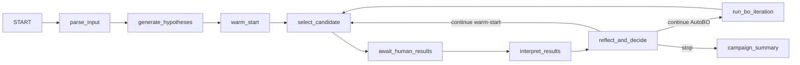

# ChemBO AutoBO Walkthrough

## Current Scope

当前主工作流已经收口为单一路径的 AutoBO 框架。

- 主图只保留 AutoBO orchestration，不再包含旧 BO、reconfigure、kernel-review、pure-reasoning 分支。
- embedding 采用 descriptor-first 解析：优先请求 `physicochemical_descriptors`，无法满足时显式记录 fallback。
- AutoBO 的算法执行集中在 `core/autobo_engine.py`，`core/graph.py` 只负责编排节点和状态流转。

## Main Graph

主图拓扑如下：

### Node Responsibilities

1. `parse_input`
   解析问题、做知识增强，并一次性完成 AutoBO bootstrap。

   写入的关键状态包括：

   - `embedding_config`
   - `bo_config`
   - `effective_config`
   - `autobo_state`
   - `knowledge_cards`
   - `retrieval_artifacts`

2. `generate_hypotheses`
   只负责生成当前可操作的化学假设，不再承担重配置准备工作。

3. `warm_start`
   使用知识卡和数据集约束生成初始 shortlist，并维护 `warm_start_queue`。

4. `run_bo_iteration`
   委托 `core/autobo_engine.py::run_autobo_iteration(...)` 执行 AutoBO 一轮 surrogate 评估、shortlist 生成和运行态配置更新。

5. `select_candidate`
   warm-start 阶段优先从队列选点；进入正式 AutoBO 后，委托 `select_autobo_candidate(...)` 做 LLM acquisition 选择和 dataset-backed 回退。

6. `await_human_results`
   写入 observation，并通过 `record_autobo_result(...)` 更新 calibration、LLM 权重和切模日志。

7. `interpret_results`
   解释实验结果、更新假设和 memory。

8. `reflect_and_decide`
   只做 `continue | stop` 决策。
   反思节流发生在 memory maintenance 之前，避免非节流轮次仍触发额外 LLM 开销。

9. `campaign_summary`
   汇总最佳结果、最终配置和 AutoBO surrogate switch 摘要。

## AutoBO Runtime

`core/autobo_engine.py` 是当前 AutoBO 控制器层，主入口有四个：

- `bootstrap_autobo_state(...)`
- `resolve_autobo_embedding(...)`
- `run_autobo_iteration(...)`
- `select_autobo_candidate(...)`
- `record_autobo_result(...)`

### 1. Bootstrap

`bootstrap_autobo_state(...)` 在 `parse_input` 阶段完成：

- embedding resolver 调用
- 静态 `bo_config` 初始化
- `effective_config` 初始化
- `autobo_state` 初始化

### 2. Embedding Resolution

`resolve_autobo_embedding(...)` 的规则是：

- 请求方法固定为 `physicochemical_descriptors`
- 首选 `PhysicochemicalDescriptorEncoder` 对应语义
- 条件不足时允许显式 fallback
- 必须保留：
  - `requested_method`
  - `resolved_method`
  - `fallback_reason`
  - `encoder_notes`

### 3. Iteration Execution

`run_autobo_iteration(...)` 负责：

- 根据 observation 构建候选池
- 调用当前 active surrogate 生成 qLogEI-inspired sequential fantasized shortlist
- 在 metadata 中写入当前实际运行组件
- 更新 `effective_config`、`bo_config` 和 `autobo_state`

### 4. Candidate Selection

`select_autobo_candidate(...)` 负责：

- 使用 AutoBO shortlist 做 LLM acquisition 选择
- 当 LLM 选中非 dataset-backed 候选时回退到合法 shortlist 项
- 记录 selection source、confidence 和 rationale

### 5. Result Recording

`record_autobo_result(...)` 负责：

- 结果回写后的 calibration 更新
- `effective_llm_weight` 降级
- `switch_history` / `calibration_log` 等运行态记录维护

## State Model

当前与 AutoBO 相关的运行态统一收在 `autobo_state`：

- `active_model`
- `fitness_log`
- `calibration_log`
- `switch_history`
- `last_layer2_iteration`
- `hysteresis_until`
- `llm_acq_audit`
- `llm_plaus_audit`
- `effective_llm_weight`

旧的以下概念已经不再属于主框架：

- embedding selection node
- legacy BO configuration node
- hypothesis refresh reconfigure path
- reconfig gate
- kernel review
- pure reasoning 主图分支

## Observability

每轮 proposal / observation 都按“实际运行时组件”记录，而不是靠历史 reconfigure 推断。

关键 metadata 包括：

- `resolved_components`
- `active_model`
- `kernel_key`
- `switch_info`
- `trigger_reason`
- `autobo_rank`

`core/campaign_runner.py` 的 iteration-config CSV 也是基于 observation metadata 回放每轮配置。

## Shared Tools

主图共享工具已经精简为：

- `hypothesis_generator`
- `result_interpreter`

检索工具继续按节点动态绑定。

## Maintenance Notes

如果后续继续扩展 AutoBO，建议遵守两条边界：

1. 编排逻辑只进 `core/graph.py`
   不把 surrogate 评估、candidate selection、结果校准重新塞回 graph 节点。

2. 算法执行只进 `core/autobo_engine.py`
   让 embedding 解析、shortlist 生成、LLM plausibility、LLM acquisition、结果回写保持同一个运行时命名空间。
